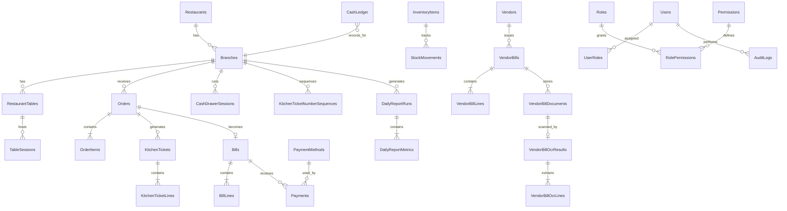

# BillSoft Database Schema

| Field | Value |
|-------|-------|
| Version | 1.0 |
| Date | 2026-06-10 |
| Database | SQL Server / Azure SQL |
| ORM | EF Core 8 |
| MVP table count | 54 |
| Status | Design complete — ready for migration implementation |

## 1. Purpose

This document is the **master database schema** for BillSoft. It defines how restaurant billing, kitchen operations, inventory, vendor bills, cash control, OCR, reporting, and audit requirements are stored in SQL Server.

BillSoft is not a simple POS database. The schema is designed to prove:

- What was ordered, prepared, billed, and paid
- What stock moved in and out
- What vendor money was owed and paid
- Who changed, cancelled, discounted, or overrode anything

Detailed column definitions live in [database-tables.md](database-tables.md). This document provides the professional overview: domains, relationships, requirement coverage, anti-duplication rules, and implementation order.

---

## 2. Design Principles

| # | Principle | Implementation |
|---|-----------|----------------|
| 1 | No hard delete for business records | Use `Status` (`Cancelled`, `Voided`, `Rejected`, `Inactive`) |
| 2 | Money uses `decimal`, never `float` | All amount columns are `decimal(18,2)` or higher precision where needed |
| 3 | Stock changes only via ledger | `StockMovements` is the source of truth; no silent stock edits |
| 4 | OCR raw vs confirmed data separated | `VendorBillOcrLines` ≠ `VendorBillLines` |
| 5 | Overrides require audit | `VendorBillOverrideAudits` + `AuditLogs` |
| 6 | Bill numbers immutable after issue | Unique constraint on `Bills.BillNumber` per branch |
| 7 | Files in object storage | `VendorBillDocuments` stores path/hash only |
| 8 | Restaurant operating day | `BusinessDate` on operational tables, separate from `CreatedAt` (UTC) |
| 9 | Role-based access | `Users` → `UserRoles` → `RolePermissions` → `Permissions` |
| 10 | Traceability over convenience | Status history + audit tables for sensitive workflows |

---

## 3. Requirement Traceability

Every requirement maps to one primary domain. No requirement needs a duplicate table.

| Req | Requirement summary | Primary domain | Core tables |
|-----|---------------------|----------------|-------------|
| 1 | Simple billing + leakage control for SMB restaurants | Platform setup | `Restaurants`, `Branches`, `RestaurantSettings` |
| 2 | Eat-in and parcel/takeaway with separate workflows | Orders | `RestaurantTables`, `TableSessions`, `Orders`, `OrderItems` |
| 3 | Large-button order screen, minimal typing | Menu | `MenuCategories`, `MenuItems`, `MenuItemPriceHistory` |
| 4 | Kitchen ticket foundation with preparation status | Kitchen | `KitchenStations`, `KitchenTickets`, `KitchenTicketLines`, `KitchenTicketNumberSequences` |
| 5 | Auto-numbered bills, multi-method payment, close after payment | Billing | `Bills`, `BillLines`, `PaymentMethods`, `Payments` |
| 6 | Fraud prevention (no delete, no hidden discount) | Billing + Audit | `Bills`, `MenuItemPriceHistory`, `OrderItemStatusHistory`, `AuditLogs` |
| 7 | Audit log for all important actions | Audit | `AuditLogs` (+ domain-specific history tables) |
| 8 | Role-based access control | Security | `Users`, `Roles`, `Permissions`, `UserRoles`, `RolePermissions`, `Devices`, `UserSessions` |
| 9 | Owner dashboard (sales, cash, dues, alerts) | Reporting | `DailyReportRuns`, `DailyReportMetrics`, `AlertRules`, `AlertEvents` |
| 10 | Inventory for groceries and supplies | Inventory | `InventoryCategories`, `InventoryItems`, `InventoryUnits` |
| 11 | Stock levels, usage, wastage, adjustments | Inventory | `StockMovements`, `DailyStockSessions`, `DailyStockCounts` |
| 12 | Vendor bill upload/scan, secure document storage | Vendor + Documents | `Vendors`, `VendorBills`, `VendorBillDocuments` |
| 13 | OCR extraction; inventory update only after confirmation | OCR | `VendorBillOcrResults`, `VendorBillOcrLines`, `VendorBillLines`, `StockMovements` |
| 14 | Manual OCR correction with reason and audit | OCR audit | `VendorBillOverrideAudits`, `AuditLogs` |
| 15 | Money-in/out reports 3× daily | Reporting + Cash | `CashLedger`, `DailyReportRuns`, `DailyReportMetrics`, `RestaurantSettings` |

**Coverage:** All 15 requirements are satisfied. No additional tables are required beyond the 54-table MVP set.

---

## 4. Anti-Duplication Rules (Single Source of Truth)

These rules prevent repeated or conflicting data across tables.

### 4.1 Money

| Data | Single source | Supporting tables (not duplicates) |
|------|---------------|-------------------------------------|
| Customer payment | `Payments` | `CashLedger` records the money-in entry referencing `Payments.PaymentId` |
| Vendor payment | `VendorPayments` | `CashLedger` records money-out referencing `VendorPayments.VendorPaymentId` |
| Expense | `Expenses` | `CashLedger` records money-out referencing `Expenses.ExpenseId` |
| Bill totals | `Bills` | `BillLines` are line detail; amounts roll up to `Bills` |

`CashLedger` is the **unified money ledger** for reporting. It does not replace `Payments` — it references them.

### 4.2 Stock

| Data | Single source | Rule |
|------|---------------|------|
| Stock quantity | `StockMovements` | Every in/out is a movement row |
| Current stock display | Derived from movements | `InventoryItems.CurrentStock` may exist as a **cached snapshot** updated only when a movement is posted; it is never edited directly |

### 4.3 Vendor bill lifecycle

```text
VendorBillDocuments  →  VendorBillOcrResults  →  VendorBillOcrLines
                              ↓ (user confirms)
                         VendorBillLines  →  StockMovements
                              ↓ (if corrected)
                         VendorBillOverrideAudits
```

OCR values and confirmed values are **intentionally separate tables**, not duplicates.

### 4.4 Status vs audit history

| Table type | Purpose | Example |
|------------|---------|---------|
| Workflow status history | Track operational state changes | `OrderItemStatusHistory` |
| Security audit log | Track sensitive/fraud-related actions | `AuditLogs` |
| Price change history | Track menu price changes | `MenuItemPriceHistory` |

These are not redundant — each serves a different reporting and compliance need.

### 4.5 Order vs kitchen status

| Layer | Table | Why separate |
|-------|-------|--------------|
| Customer order | `Orders`, `OrderItems` | Waiter/cashier view |
| Kitchen preparation | `KitchenTickets`, `KitchenTicketLines`, `KitchenTicketNumberSequences` | Kitchen ticket foundation view |

One confirmed order may produce a kitchen ticket foundation record with snapshot lines. Status changes are tracked on the ticket itself and through audit logs, not through a separate kitchen status history table in this slice.

---

## 5. Domain Model

### 5.1 High-level ER diagram



### 5.2 Domain groups (54 MVP tables)

#### A. Platform (3 tables)

| Table | Role |
|-------|------|
| `Restaurants` | Company/restaurant master |
| `Branches` | Outlet per restaurant |
| `RestaurantSettings` | Config: tax, report times, discount thresholds |

#### B. Security (7 tables)

| Table | Role |
|-------|------|
| `Users` | Staff and owner accounts |
| `Roles` | Waiter, Cashier, Kitchen, Owner, SuperAdmin |
| `Permissions` | Fine-grained permission codes |
| `UserRoles` | User-to-role mapping |
| `RolePermissions` | Role-to-permission mapping |
| `Devices` | POS, kitchen screen, tablet registration |
| `UserSessions` | Login session tracking |

#### C. Menu (4 tables)

| Table | Role |
|-------|------|
| `MenuCategories` | Meals, Biryani, Drinks, etc. |
| `MenuItems` | Food/drink items with eat-in and parcel price |
| `MenuItemPriceHistory` | Price change audit trail |
| `KitchenStations` | Main kitchen, tea counter, juice counter |

#### D. Orders (5 tables)

| Table | Role |
|-------|------|
| `RestaurantTables` | Physical dining tables |
| `TableSessions` | Open table session (eat-in) |
| `Orders` | Eat-in or parcel order header |
| `OrderItems` | Line items with captured price |
| `OrderItemStatusHistory` | Per-item status change trail |

#### E. Kitchen (3 tables)

| Table | Role |
|-------|------|
| `KitchenTickets` | Kitchen preparation ticket generated from confirmed POS order snapshots |
| `KitchenTicketLines` | Items to prepare copied from POS order lines |
| `KitchenTicketNumberSequences` | Daily ticket numbering sequence |

#### F. Billing and cash (6 tables)

| Table | Role |
|-------|------|
| `Bills` | Customer bill with immutable bill number |
| `BillLines` | Bill line items (snapshot at billing) |
| `PaymentMethods` | Cash, UPI, Card, Bank, Credit |
| `Payments` | Payment collection (supports mixed payment) |
| `CashDrawerSessions` | Cashier shift with opening/closing cash |
| `CashLedger` | Unified money-in / money-out ledger |

#### G. Inventory (6 tables)

| Table | Role |
|-------|------|
| `InventoryCategories` | Grocery, meat, gas, drinks, etc. |
| `InventoryUnits` | kg, litre, piece, cylinder |
| `InventoryItems` | Stock item master |
| `StockMovements` | All stock in/out (purchase, usage, wastage, adjustment) |
| `DailyStockSessions` | Daily stock check session |
| `DailyStockCounts` | Per-item opening, purchase, closing, usage, variance |

#### H. Vendors (5 tables)

| Table | Role |
|-------|------|
| `VendorCategories` | Grocery, gas, water, meat, etc. |
| `Vendors` | Vendor master |
| `VendorBills` | Purchase bill header |
| `VendorBillLines` | Confirmed purchase lines |
| `VendorPayments` | Vendor settlement payments |

#### I. Vendor OCR (5 tables)

| Table | Role |
|-------|------|
| `VendorBillDocuments` | Uploaded file metadata (blob storage path) |
| `VendorBillOcrResults` | OCR run header and raw text |
| `VendorBillOcrLines` | OCR-extracted line items (pre-confirmation) |
| `VendorBillOverrideAudits` | Manual correction audit |
| `InventoryItemAliases` | English/Tamil/vendor name → inventory item mapping |

#### J. Expenses (2 tables)

| Table | Role |
|-------|------|
| `ExpenseCategories` | Rent, electricity, maintenance, etc. |
| `Expenses` | Money-out expense records |

#### K. Reporting and alerts (5 tables)

| Table | Role |
|-------|------|
| `DailyReportRuns` | Morning / afternoon / closing report execution |
| `DailyReportMetrics` | Snapshot metrics per report run |
| `AlertRules` | Low stock, cash difference, high cancellation thresholds |
| `AlertEvents` | Triggered alert instances |
| `Notifications` | App/email/WhatsApp delivery log |

#### L. Audit (2 tables)

| Table | Role |
|-------|------|
| `AuditLogs` | Central anti-fraud audit trail |
| `LoginAttempts` | Login success/failure tracking |

#### M. Future phase (not in MVP migration)

| Table | Role |
|-------|------|
| `Recipes` | Menu item recipe definitions |
| `RecipeIngredients` | Ingredient quantities per recipe |

---

## 6. Key Relationships and Cardinality

| Parent | Child | Relationship | Notes |
|--------|-------|--------------|-------|
| `Restaurants` | `Branches` | 1:N | Multi-branch support |
| `Branches` | `Orders` | 1:N | All orders scoped to branch |
| `TableSessions` | `Orders` | 1:N | Eat-in only; parcel orders have `TokenNumber` instead |
| `Orders` | `OrderItems` | 1:N | Price captured at order time |
| `Orders` | `Bills` | 1:1 | One bill per order (MVP) |
| `Bills` | `Payments` | 1:N | Mixed payment = multiple rows |
| `VendorBills` | `VendorBillLines` | 1:N | Lines created after OCR confirmation |
| `VendorBillDocuments` | `VendorBillOcrResults` | 1:1 | One OCR run per document (latest retained) |
| `InventoryItems` | `StockMovements` | 1:N | Append-only stock ledger |

---

## 7. Critical Constraints and Indexes

### 7.1 Unique constraints (business immutability)

| Constraint | Table | Columns | Reason |
|------------|-------|---------|--------|
| `UX_Bills_BranchId_BillNumber` | `Bills` | `BranchId`, `BillNumber` | Immutable bill numbers (Req 5, 6) |
| `UX_Orders_BranchId_OrderNumber` | `Orders` | `BranchId`, `OrderNumber` | Unique order reference |
| `UX_VendorBills_VendorId_BillNumber_BillDate` | `VendorBills` | `VendorId`, `BillNumber`, `BillDate` | Duplicate vendor bill detection (Req 12) |
| `UX_Permissions_Code` | `Permissions` | `Code` | Stable permission codes (Req 8) |

### 7.2 Recommended indexes (reporting and lookup)

| Index | Table | Columns |
|-------|-------|---------|
| `IX_Orders_BranchId_BusinessDate` | `Orders` | `BranchId`, `BusinessDate`, `Status` |
| `IX_Bills_BranchId_BusinessDate` | `Bills` | `BranchId`, `BusinessDate`, `Status` |
| `IX_Payments_BillId` | `Payments` | `BillId` |
| `IX_StockMovements_InventoryItemId_CreatedAt` | `StockMovements` | `InventoryItemId`, `CreatedAt` |
| `IX_VendorBills_VendorId_Status` | `VendorBills` | `VendorId`, `Status` |
| `IX_AuditLogs_RestaurantId_CreatedAt` | `AuditLogs` | `RestaurantId`, `CreatedAt` |
| `IX_CashLedger_BranchId_BusinessDate` | `CashLedger` | `BranchId`, `BusinessDate` |
| `IX_DailyReportRuns_BranchId_BusinessDate` | `DailyReportRuns` | `BranchId`, `BusinessDate`, `ReportType` |

Full naming rules: [naming-conventions.md](naming-conventions.md).

### 7.3 Status values

All `Status` column allowed values are defined in [status-transitions.md](../architecture/status-transitions.md). Enforce in application layer; optionally use check constraints in SQL Server for critical tables.

---

## 8. Core Workflows (Schema Support)

### 8.1 Eat-in order → bill → payment

```text
RestaurantTables
  → TableSessions (Open)
    → Orders (OrderType = EatIn)
      → OrderItems
        → KitchenTickets → KitchenTicketLines
      → Bills → BillLines
        → Payments
          → CashLedger (MoneyIn)
      → TableSessions (Closed)
```

### 8.2 Parcel order

Same as eat-in except: no `TableSession`; `Orders.TokenNumber` is set; `OrderType = Parcel`.

### 8.3 Vendor bill OCR → stock

```text
VendorBills (Status = Uploaded)
  → VendorBillDocuments (blob storage)
    → VendorBillOcrResults
      → VendorBillOcrLines (ReviewStatus = Pending)
        → [user confirms]
      → VendorBillLines
        → StockMovements (MovementType = Purchase)
      → VendorBillOverrideAudits (if corrected)
  → VendorBills (Status = Confirmed)
```

### 8.4 Daily reports (3× per day)

```text
RestaurantSettings (report times)
  → DailyReportRuns (Morning | Afternoon | Closing)
    → DailyReportMetrics (sales, cash, inventory, vendor, suspicious)
```

Metrics are **snapshots** — they do not replace source tables.

---

## 9. Seed Data (Required Before UAT)

Reference data to seed idempotently (see `database/seed/README.md`):

| Seed area | Tables affected |
|-----------|-----------------|
| System roles | `Roles` |
| Permission codes | `Permissions`, `RolePermissions` |
| Payment methods | `PaymentMethods` |
| Inventory units | `InventoryUnits` |
| Vendor categories | `VendorCategories` |
| Expense categories | `ExpenseCategories` |
| Kitchen stations | `KitchenStations` |
| Report types | Used by `DailyReportRuns.ReportType` enum |

Do not seed demo transactions in production.

---

## 10. Implementation Order

### Phase 1 — Foundation
`Restaurants`, `Branches`, `RestaurantSettings`, `Users`, `Roles`, `Permissions`, `UserRoles`, `RolePermissions`

### Phase 2 — Menu and orders
`MenuCategories`, `MenuItems`, `KitchenStations`, `RestaurantTables`, `TableSessions`, `Orders`, `OrderItems`, `OrderItemStatusHistory`

### Phase 3 — Kitchen and billing
`KitchenTickets`, `KitchenTicketLines`, `KitchenTicketNumberSequences`, `Bills`, `BillLines`, `PaymentMethods`, `Payments`, `CashDrawerSessions`, `CashLedger`

### Phase 4 — Inventory and vendors
`InventoryCategories`, `InventoryUnits`, `InventoryItems`, `StockMovements`, `Vendors`, `VendorCategories`, `VendorBills`, `VendorBillLines`, `VendorPayments`

### Phase 5 — OCR and audit
`VendorBillDocuments`, `VendorBillOcrResults`, `VendorBillOcrLines`, `VendorBillOverrideAudits`, `InventoryItemAliases`, `AuditLogs`, `LoginAttempts`

### Phase 6 — Reporting and expenses
`ExpenseCategories`, `Expenses`, `DailyStockSessions`, `DailyStockCounts`, `DailyReportRuns`, `DailyReportMetrics`, `AlertRules`, `AlertEvents`, `Notifications`, `Devices`, `UserSessions`

### Phase 7 — Future
`Recipes`, `RecipeIngredients`

---

## 11. Next Steps (Development)

| Step | Action | Owner |
|------|--------|-------|
| 1 | Review and approve this schema with stakeholders | Product / Santhosh |
| 2 | Create EF Core entity classes from [database-tables.md](database-tables.md) | Backend |
| 3 | Generate `InitialCreate` migration | Backend |
| 4 | Apply migration to local SQL Server (`BillSoft` database) | Backend |
| 5 | Implement idempotent seed script | Backend |
| 6 | Add integration tests for constraints and status transitions | Backend |

Command reference:

```bash
dotnet ef migrations add InitialCreate \
  --project src/api/BillSoft.Infrastructure/BillSoft.Infrastructure.csproj \
  --startup-project src/api/BillSoft.Api/BillSoft.Api.csproj

dotnet ef database update \
  --project src/api/BillSoft.Infrastructure/BillSoft.Infrastructure.csproj \
  --startup-project src/api/BillSoft.Api/BillSoft.Api.csproj
```

---

## 12. Document Cross-Reference

| Need | Document |
|------|----------|
| Every column definition | [database-tables.md](database-tables.md) |
| Table/column naming | [naming-conventions.md](naming-conventions.md) |
| Migration review rules | [migration-guidelines.md](migration-guidelines.md) |
| Status enum values | [status-transitions.md](../architecture/status-transitions.md) |
| Permission codes | [permission-matrix.md](../requirements/permission-matrix.md) |

---

## 13. Approval

| Role | Name | Date | Status |
|------|------|------|--------|
| Product | Santhosh Intelsoft | | Pending review |
| Database design | Lokesh | 2026-06-10 | Draft complete |
